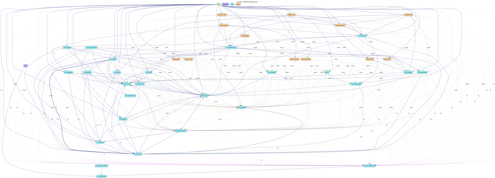

# Estatia

> Rental infrastructure for emerging markets.

Estatia is a scalable digital platform powering trusted property discovery, landlord tooling, and monetized listing distribution. Built for national scale. Architected for long-term evolution.

---

## The Opportunity

Rental markets in emerging economies remain fragmented, offline-heavy, and trust-constrained. Discovery is inefficient. Visibility is uneven. Monetization is underdeveloped.

Estatia digitizes and structures this ecosystem.

---

## What Estatia Delivers

### Discovery Engine

* Location-aware property search
* Map-based exploration
* Personalized vertical media feed (match-aware prefetching)
* Structured filtering (price, type, amenities)

### Listing Infrastructure

* Multi-stage listing workflow
* Media upload pipeline
* Ownership validation
* Full lifecycle management

### Engagement & Analytics

* Likes, saves, comments
* Owner performance dashboard
* Exposure tracking

### Monetization Layer

* Integrated service fee processing
* Foundation for premium visibility tiers
* Monetization-first architecture

### Trust Framework

* Role-based access control
* Admin moderation pipeline
* Owner verification workflows

---

## Architecture

Estatia is built with strict modular boundaries and production-grade discipline.



**Principles**

* Clean Architecture
* Dependency inversion
* Interface-driven design
* Unidirectional data flow
* Immutable state modeling
* Lifecycle-safe concurrency
* Zero business logic in UI

**Module Structure**

```
:app
:benchmark
:localization
:lint
:core:analytics
:core:network
:core:ui
:core:common
:core:notifications
:core:data
:core:domain
:core:model
:core:database
:core:security
:core:datastore
:core:intelligence
:core:player-engine
:core:player-ui
:core:design-system
:core:testing
:core:datastore-proto
:feature:home
:feature:auth
:feature:profile
:feature:search
:feature:property
:feature:payments
:feature:market
:feature:chats
:feature:favorites
:feature:comments
:feature:settings
:feature:shared-ui
```

---

## Technology

* Kotlin
* Jetpack Compose (Material 3)
* MVVM
* Hilt
* Coroutines + Flow
* Firebase (Auth, Firestore, Storage)
* Google Maps SDK
* ExoPlayer
* Gradle Convention Plugins + Version Catalogs
* Baseline Profiles + Benchmarking

---

## Scalability

Engineered for:

* High-throughput media feeds
* Optimized Firestore query patterns
* Memory-efficient media handling
* Deterministic state management
* Cross-platform expansion (Android, iOS, Web)

---

## Security

* Server-enforced ownership rules
* Role-based access control
* Defensive validation
* Clear client/server boundaries

---

## Developer Resources

For contributors and engineers seeking deeper technical insights:

* [ARCHITECTURE.md](./docs/ARCHITECTURE.md) — Full system architecture, module responsibilities, data flow, concurrency, and scalability.
* [ENGINEERING.md](./docs/ENGINEERING.md) — Coding standards, testing, performance, security, CI/CD, and developer guidelines.

---

## Vision

Estatia is building the foundational rental infrastructure layer for emerging markets — enabling scalable, transparent, and monetizable property ecosystems across platforms.
