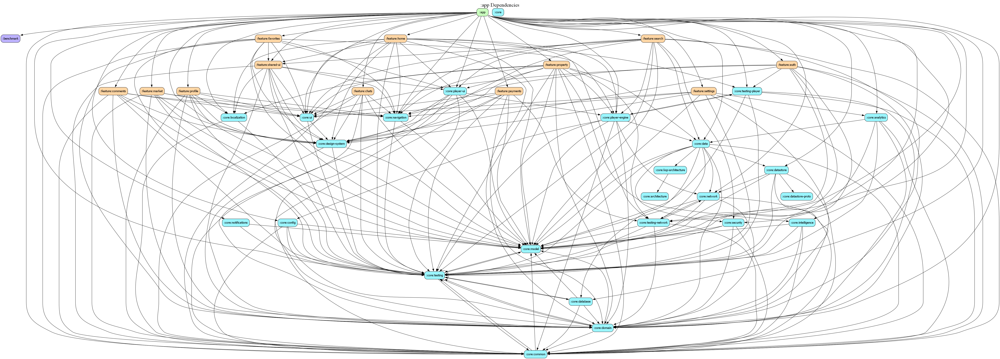

# app

## Overview
The `app` module is the entry point for the Estatia Android application. It orchestrates the various feature modules, sets up the global navigation host, and provides the top-level application and activity classes.

## Responsibilities
- **Navigation**: Defines the `EstatiaNavHost` which connects all feature graphs.
- **Dependency Injection**: Sets up the Hilt Singleton Component and provides app-wide dependencies.
- **Global UI**: Implements the `EstatiaApp` Composable, including the bottom navigation bar and snackbar host.
- **Process Orchestration**: Manages app-level lifecycles, background synchronization, and deep link resolution.

## App State
The module uses a centralized `EstatiaAppState` class to manage navigation logic, network status monitoring, and unread notification states in a reactive way.

## Configuration Files

The `app` module requires two critical configuration files to enable remote backend services. These files are typically gitignored in production environments but are provided as baselines for development.

### AWS Amplify (`amplifyconfiguration.json`)
- **Location**: `app/src/main/res/raw/amplifyconfiguration.json`
- **Purpose**: This file contains the endpoint information, regions, and client IDs for AWS services managed via the Amplify SDK.
- **Note**: The version committed to source control is a **stub/placeholder** configuration. It is included explicitly (and not gitignored like `google-services.json`) to demonstrate that the application is fully "AWS Ready" and to show the expected structure for reviewers. In a production environment, this file should be excluded from the repository.
- **Enabled Services**:
    - **Auth**: Cognito User Pool and Identity Pool settings.
    - **API**: AppSync GraphQL endpoint details for Aurora Serverless data.
    - **Storage**: S3 bucket information for property media uploads.
    - **Analytics**: Pinpoint project IDs for event tracking.

### Google Services (`google-services.json`)
- **Location**: `app/google-services.json`
- **Purpose**: Required by the Google Services Gradle plugin to enable integration with Google and Firebase services.
- **Used For**:
    - **Google Sign-In**: Providing the OIDC client ID used by the Auth layer.
    - **Maps SDK**: Associating the application with the correct Google Cloud Project for Map rendering.
    - **Firebase Support**: Enabling Crashlytics, Performance Monitoring, and Cloud Messaging (FCM).

## Dependency Graph

