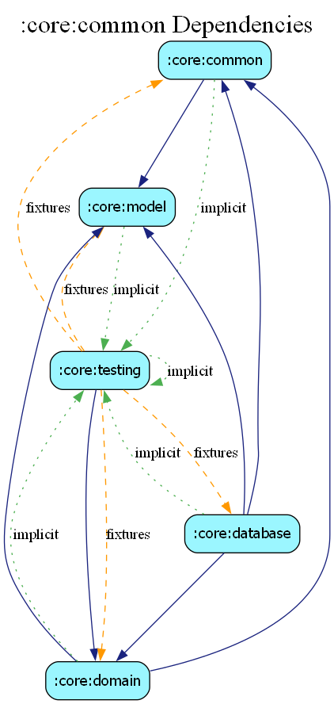

# core:common

## Overview
The `common` module contains shared utilities, base classes, and core interfaces used throughout the entire application. It is the foundation of the codebase and has minimal dependencies.

## Structure
- `exceptions/`: Defines the global `AppResult` and `AppException` hierarchy for robust error handling.
- `system/`: Utilities for interacting with Android system services (e.g., `DeviceUtils`, `LocationUtils`).
- `media/`: Shared logic for handling URIs and media assets.
- `events/`: Definitions for cross-module events and event bus message types.
- `interfaces/`: Fundamental interfaces like `ILogger` and base repository contracts.

## Dependency Graph

