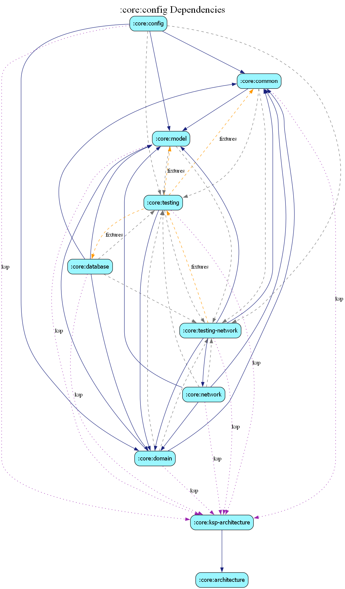

# core:config

## Overview
The `config` module manages the application's dynamic configuration. It allows for enabling/disabling features, tweaking parameters, and handling environment-specific settings without requiring a new app release.

## Key Features
- **Remote Config Integration**: Connects with backend providers (e.g., Firebase Remote Config) to fetch live settings.
- **Local Fallbacks**: Provides sensible default values if remote config is unavailable.
- **Type-Safe Access**: Offers a strongly-typed API for accessing configuration values.

## Key Components
- `IConfigProvider`: Interface for requesting configuration values.
- `ConfigRepositoryImpl`: Orchestrates local storage and remote fetching.

## Dependency Graph

