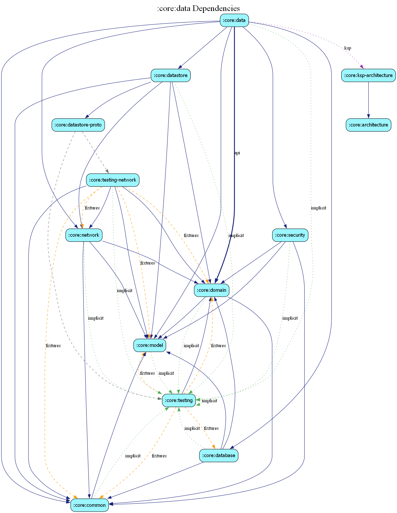

# core:data

The `data` module implements the repository interfaces defined in `core:domain`. it acts as the "Source of Truth" for the entire application, orchestrating data from multiple sources.

## Key Responsibilities

- **Repository Implementation**: Concrete implementations of `IPropertyRepository`, `IAuthRepository`, etc.
- **Data Orchestration**: Managing logic between local storage (Room, DataStore) and remote sources (AWS Amplify via `core:network`).
- **Mapping**: Converting infrastructure-specific entities (from `core:network` or `core:database`) into domain-level models.
- **Synchronization**: Logic for syncing local drafts or offline state with the remote server.

## Data Flow

Data typically flows from a `RemoteDataSource` or `LocalDataSource` into a `Repository`, where it is mapped to a `DomainModel` before being exposed to the `domain` or `feature` layers.

## Dependency Graph

