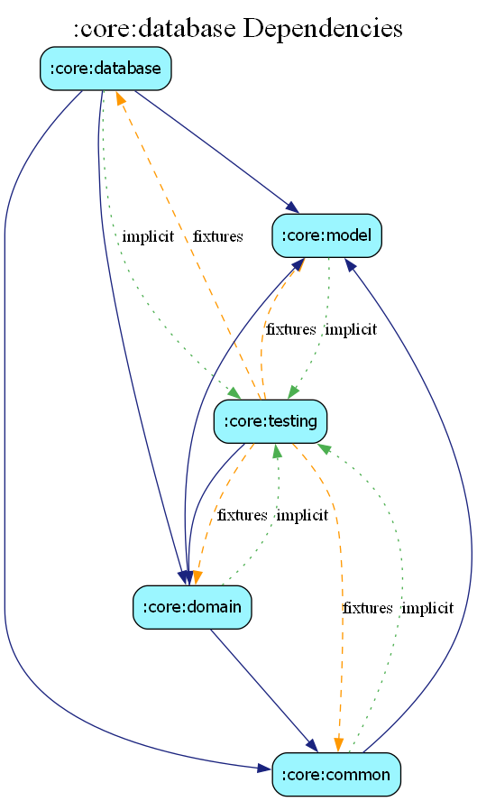

# core:database

## Overview
The `database` module provides local data persistence for Estatia using the Room persistence library. It handles caching for properties, search history, and offline analytics.

## Responsibilities
- **Data Persistence**: Offline storage for faster load times and limited offline support.
- **DAO Definitions**: Room Data Access Objects for querying and modifying the local cache.
- **Entities**: Mapping of Room entities to internal database tables.

## Key Databases
- `PropertyDatabase`: Caches property listings and related metadata.
- `SearchDatabase`: Stores the user's search history.
- `AnalyticsDatabase`: Temporarily buffers analytics events before they are uploaded.

## Dependency Graph

