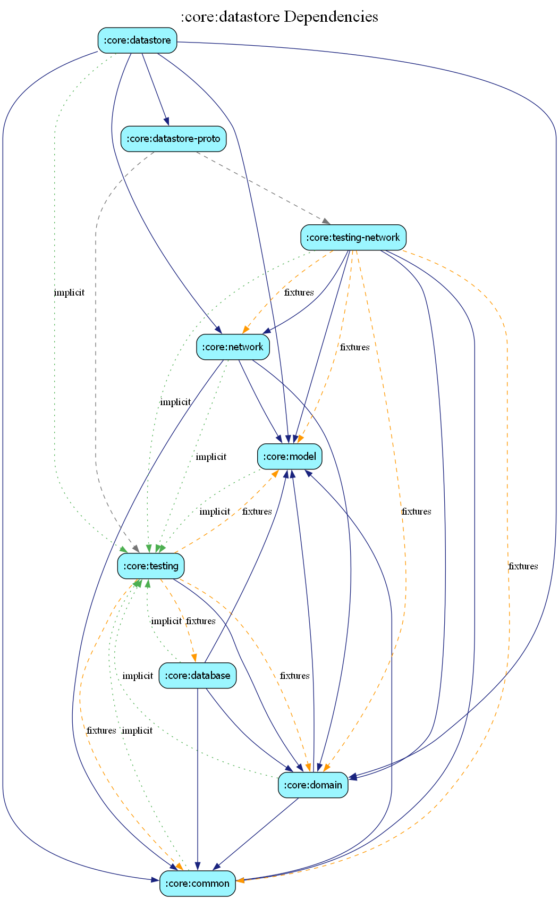

# core:datastore

## Overview
The `datastore` module manages the application's lightweight persistent storage using Jetpack DataStore (Proto). It is primarily used for storing user preferences, theme settings, and small amounts of session-related data.

## Features
- **Typed Storage**: Uses Protocol Buffers for structured, type-safe data storage.
- **Migrations**: Built-in support for migrating data between different schema versions.
- **Reactive API**: Exposes stored data as Kotlin Flows for real-time UI updates.

## Key Components
- `EstatiaPreferencesDataSource`: The primary data source for reading and writing preferences.
- `UserPreferencesSerializer`: Handles the serialization and deserialization of the proto-generated classes.

## Dependency Graph

