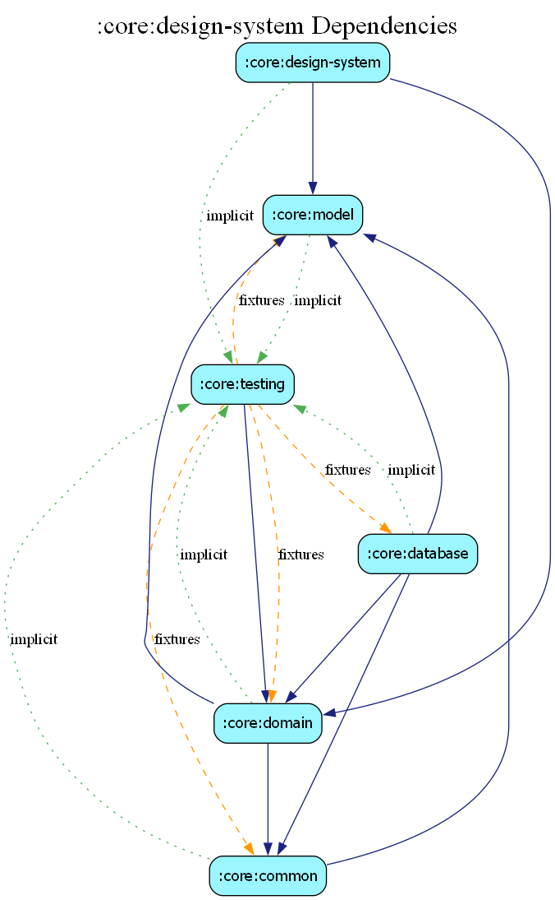

# core:design-system

## Overview
The `design-system` module is the single source of truth for the visual language and reusable UI components of the Estatia app. It follows Material Design 3 guidelines while providing custom components tailored to our real estate context.

## Key Features
- **Theming**: Global `EstatiaTheme` providing colors, typography, and shapes.
- **Custom Components**: High-level wrappers like `EstatiaButton`, `EstatiaTextField`, and `EstatiaCard` to ensure visual consistency.
- **Iconography**: Centralized `EstatiaIcons` registry using both standard Material icons and custom assets.
- **Foundations**: Shared background components, gradients, and layout modifiers.

## Best Practices
- Feature modules should **always** use components from this module instead of raw Material 3 components directly.
- Avoid adding business logic to this module; it should remain a pure presentation library.

## Dependency Graph

