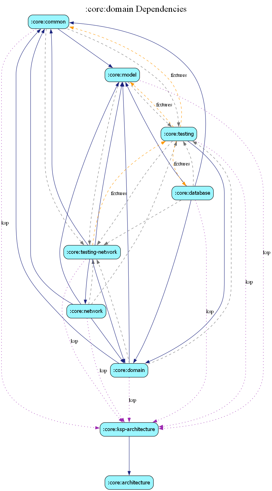

# core:domain

The `domain` module contains the purest form of business logic in the application. It is completely independent of Android frameworks, UI, or specific data storage implementations.

## Key Components

- **Domain Models**: Immutable data classes representing business entities (e.g., `PropertyDomainModel`, `AuthUserDomainModel`).
- **Use Cases**: Encapsulate single, reusable units of business logic (e.g., `GetPropertyUseCase`, `TogglePropertyLikeUseCase`).
- **Domain Interfaces**: Organized into logical sub-packages to improve modularity and adhere to the Interface Segregation Principle:
    - `config`: Lifecycle and role-based configuration interfaces.
    - `repository`: Data access contracts for properties, users, and search.
    - `analytics`: Observability, metrics, and engagement tracking.
    - `security`: Authentication and cryptographic operation contracts.
    - `common`: Cross-cutting concerns like exception translation.

## Principles

1.  **Framework Independence**: Should not import any `android.*` or `androidx.*` packages (except for lightweight annotations).
2.  **Stability**: Changes in API versions or database schemas should not leak into this module.
3.  **Testability**: Logic is easily unit-testable without mocks for Android components.
4.  **Interface Segregation**: Clients depend only on the specific configuration or repository roles they require.
5.  **Secure Updates**: General resource updates are restricted to allowlisted fields (e.g., `PropertyUpdateFields`) to prevent unintentional state corruption or metadata tampering.

## Dependency Graph

