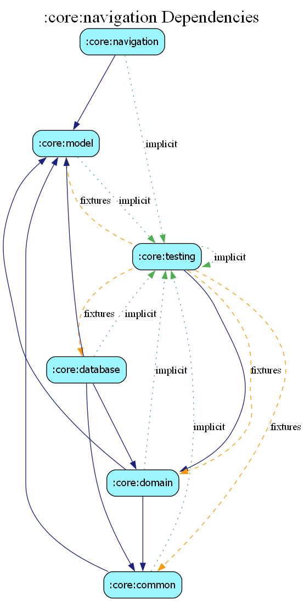

# core:navigation

## Overview
The `navigation` module provides a centralized, type-safe navigation system for the entire application. It defines the route contracts that allow feature modules to communicate without direct dependencies.

## Structure
The module is organized into sub-files to prevent a single "god" route class:
- `routes/AuthRoutes.kt`
- `routes/HomeRoutes.kt`
- `routes/SearchRoutes.kt`
- `routes/PropertyRoutes.kt`
- `routes/ChatRoutes.kt`
- `routes/MarketRoutes.kt`
- ... and more.

## Usage
Feature modules should depend on this module to access the shared `Route` and `BaseRoute` definitions. Navigation is implemented using Jetpack Navigation with Kotlin Serialization for type safety.

## Dependency Graph

