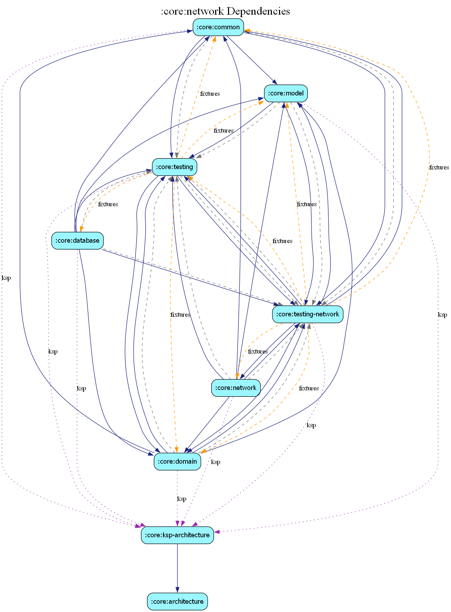

# core:network

The `network` module manages all external data communication, providing a robust layer over backend providers like Firebase and AWS. It follows a pluggable architecture, allowing you to swap between infrastructure providers without changing business logic or UI code.

## Key Responsibilities

- **Remote Data Access**: Implements data sources for properties, users, search, and more.
- **Authentication**: Supports multiple providers for email/password, social login, and OIDC flows.
- **Resilience**: Provides a unified `INetworkClient` with customizable retry policies (e.g., `ExponentialRetryPolicy`).
- **Error Mapping**: Translates infrastructure-specific exceptions (Firebase, AWS, OkHttp) into consistent domain-level [AppResult] types via a robust routing system.
- **Backend Agnosticism**: Uses a generic `IBackendInitializer` system to handle provider-specific startup tasks.

## Multi-Backend Strategy

The module is structured to support both **Firebase** and **AWS** backends. Each service is mapped as follows:

| Service | Firebase Provider | AWS Provider (Amplify/SDK) |
| :--- | :--- | :--- |
| **Auth** | Firebase Authentication | AWS Cognito / Amplify Auth |
| **Data (Properties/Users)** | Cloud Firestore | AWS AppSync + Amazon Aurora |
| **Comments** | Cloud Firestore | AWS AppSync (Subscriptions) |
| **Search** | Firestore Manual Matching | AWS OpenSearch (via AppSync) |
| **Storage** | Firebase Storage | Amazon S3 |
| **Analytics** | Google Analytics for Firebase | Amazon Pinpoint |
| **Crash Reporting** | Firebase Crashlytics | Amazon CloudWatch Logs |
| **Secure Ops (Payments)** | Firebase Cloud Functions | AWS Lambda (via AppSync) |
| **Remote Config** | Firebase Remote Config | AWS AppConfig |

## Swapping Backends

Switching between backend providers is handled in the dependency injection layer.

1.  **DI Configuration**: Open `ProdDataSourcesModule.kt` and update the `@Provides` bindings to point to your desired implementation (e.g., swapping `FirestoreProperties` for `AwsPropertyRemoteDataSource`).
2.  **Provider Configuration**:
    - **For AWS**: Ensure `amplifyconfiguration.json` is placed in `app/src/main/res/raw/`.
    - **For Firebase**: Ensure `google-services.json` is present in the `app` module.
3.  **Initialization**: AWS integration is managed via `AwsBackendInitializer.kt`, which registers the necessary Amplify plugins.

## Error Mapping System

The `network` module implements a centralized error mapping system that translates technical infrastructure exceptions into domain-friendly types. This ensures that features and UI components don't have to handle backend-specific error details (like HTTP codes or AWS exception classes).

### Generic Infrastructure Exceptions
All errors are mapped to one of these generic types defined in `core:common`:
- `AuthException`: Covers user lifecycle issues (e.g., `UserNotFound`, `SessionExpired`).
- `DatabaseException`: Covers data persistence issues (e.g., `PermissionDenied`, `NotFound`).
- `StorageException`: Covers media upload/download issues (e.g., `QuotaExceeded`).
- `NetworkException`: Covers connectivity and general protocol issues (e.g., `NoConnectivity`).

### Robust Routing (`ExceptionMapper`)
The `ExceptionMapper` class acts as a smart router. It receives an exception and determines its origin (AWS, Firebase, or general Network) by inspecting its type. It then delegates the actual mapping to specialized sub-mappers using Dagger Qualifiers (`@AwsMapper` and `@FirebaseMapper`).

| Interface | Firebase Implementation | AWS Implementation |
| :--- | :--- | :--- |
| `IAuthExceptionMapper` | `FirebaseAuthErrorMapper` | `AwsAuthErrorMapper` |
| `IDatabaseErrorMapper` | `FirebaseFirestoreErrorMapper` | `AwsDatabaseErrorMapper` |
| `IStorageErrorMapper` | `FirebaseStorageErrorMapper` | `AwsStorageErrorMapper` |
| `IInfrastructureErrorMapper` | `FirebaseFallbackErrorMapper` | `AwsInfrastructureErrorMapper` |

### Usage in DataSources
Data sources use the `ProductionNetworkClient.execute { ... }` wrapper. This wrapper automatically catches any thrown exceptions and passes them through the `ExceptionMapper` before returning an `AppResult.Error`.

## Key Interfaces

- `INetworkClient`: The core engine for executing requests with retry logic.
- `IPropertyRemoteDatasource`: Manages property listings, uploads, and interactions.
- `IAuthRemoteDataSource`: Handles the user lifecycle and authentication flows.
- `ICrashReporter`: Generic interface for error and crash logging.
- `IBackendInitializer`: Generic interface for backend SDK startup logic.

## Data Models

The module uses `EntityModel` classes (e.g., `PropertyEntityModel`) which represent the structure of data as it exists on the server. These are shared across providers where possible to ensure the `core:data` repository layer remains provider-agnostic.

## Dependency Graph

