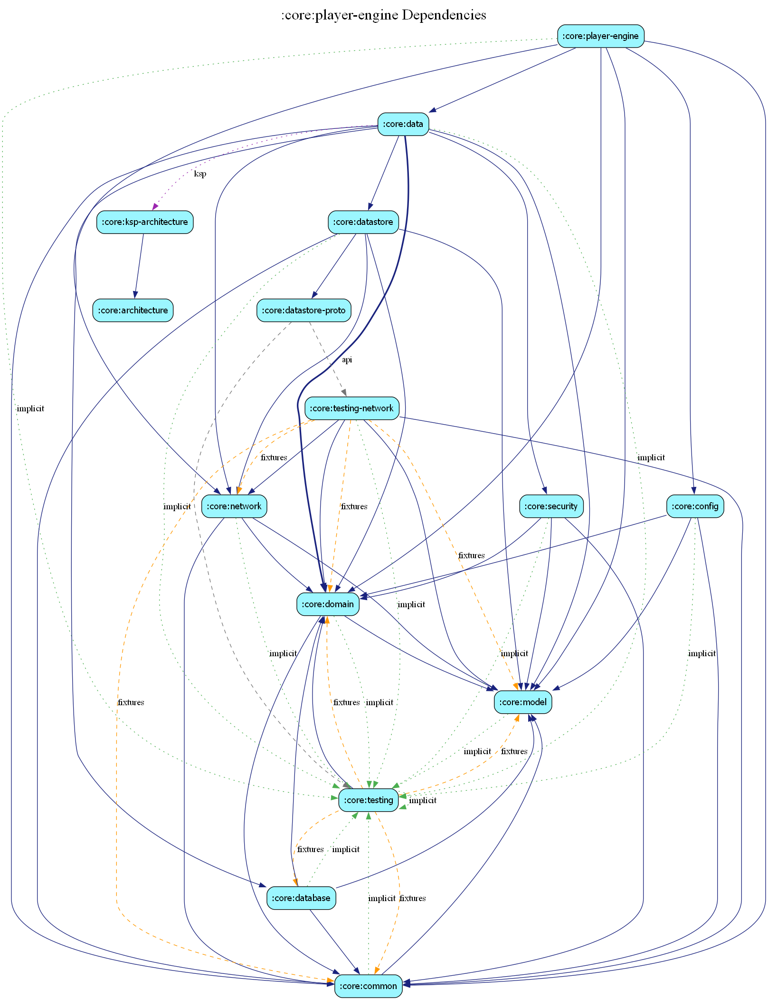

# Estatia Media Engine  Technical Specification

The `player-engine` module is a high-performance, resilient, and resource-aware orchestration layer built on top of **Media3 ExoPlayer**. It is engineered to deliver a fluid, "TikTok-class" video experience while maintaining strict device stability and battery discipline.

##  1. Performance Architecture

### Fling Heuristic & Adaptive Debounce
To minimize CPU and network churn during rapid navigation ("surfing"), the engine implements a velocity-aware debounce mechanism.
-   **Standard Dwell**: 100ms settle window before committed playback.
-   **Fling Mode**: If >3 pages are flipped in 300ms, the settle window increases to 250ms and neighbor preloading is suspended until velocity drops.
-   **Jank-Awareness**: If the UI thread is dropping frames (>20% jank ratio), the engine automatically increases debounce to 400ms, prioritizing scroll smoothness over autoplay latency.
-   **Surface Binding**: Surface acquisition is debounced in the UI layer to match the engine's settle window, preventing unnecessary hardware-resource "locking" for skipped content.

### Symmetric & Deep Prefetching
The engine maintains a deep look-ahead window with **Priority Decay** to ensure seamless forward and backward scrolling.
-   **Visible**: 100% byte budget (High priority).
-   **Next (N+1)**: 70% budget.
-   **Previous (N-1)**: 40% budget (Ensures instant back-scroll).
-   **Far-Ahead (N+2)**: 20% budget (Speculative bytes only).
-   **Pinning Mechanism**: Every visible video is "pinned" in the pool. The eviction logic strictly respects these pins, ensuring that no video is released while its surface is still composed in the UI.

## 2. Fault Tolerance & Reliability

### BOLA-lite (Buffer-Aware ABR)
The ABR policy incorporates real-time buffer occupancy to proactively prevent stalls.
-   **Critical Threshold**: If buffer < 2s, the bitrate cap is slashed by 50% regardless of throughput.
-   **Precautionary Threshold**: If buffer < 5s, a 20% reduction is applied to allow the buffer to stabilize.

### Robust Network Recovery
The engine distinguishes between transient signal loss and terminal errors.
-   **Reconnecting State**: Detected network failures surface a "Reconnecting" UI rather than a hard error.
-   **Auto-Retry**: The system automatically prepares and resumes interrupted streams as soon as `INetworkStateProvider` reports a return to connectivity.

### Buffering Watchdog
A 15-second safety timer monitors every "Buffering" state. If the hardware decoder or network stream hangs without reporting an error, the watchdog triggers a synthetic recovery flow to unblock the UI.

## 3. Resource & Power Discipline

### Granular Thermal Tiers
Playback load is dynamically shed based on the device's physical temperature (`PowerManager.thermalStatus`).
-   **Moderate**: 30% bitrate reduction.
-   **Severe**: 65% bitrate reduction + **HDR Suppression** (disables high-GPU-load rendering).
-   **Critical**: 85% bitrate reduction + 360p resolution cap.

### Adaptive Storage & Buffer Budgeting
-   **Cache Scaling**: The media cache ceiling is calculated on startup as `min(512MB, availableStorage * 0.1)`, preventing the app from triggering system-level "Storage Full" warnings.
-   **Buffer Adaptation**: Buffer targets automatically shrink on metered (Cellular) or poor connections. This minimizes "data leakage" on skipped videos while maintaining snappy starts.

### Graceful Backgrounding & Resource Hygiene
-   **Immediate**: Playback pauses and audio focus is abandoned.
-   **60s Grace Timer**: Hardware decoders are preserved for quick app-switches, then released.
-   **Memory Safety**: Uses `WeakHashMap` for listener tracking, ensuring that released hardware instances are eligible for immediate garbage collection.
-   **Adaptive Polling**: Progress-bar telemetry throttles its refresh rate based on app visibility to save CPU cycles.

## 4. Hardware & System Integration

### Adaptive Player Pooling
Reuses `ExoPlayer` instances to eliminate the 300-700ms overhead of player creation. 
-   **Hardware Bounding**: The pool size is hard-capped by the device's physical hardware decoder limits (`MediaCodecInfo.maxSupportedInstances`).
-   **Memory-Safe Management**: Uses `WeakHashMap` for listener tracking, ensuring that released player instances are eligible for garbage collection immediately.
-   **Lightweight Refilling**: Implements an optimized "Idle creation" path that constructs hardware objects without the overhead of CDN resolution or configuration parsing. Refilling is done proactively in the background to avoid blocking the user thread.
-   **Urgency Promotion**: In-flight creation tasks are automatically promoted if an urgent `play()` request arrives, ensuring playback never deadlocks due to speculative preloads.
-   **O(1) Resolution**: Playback events are resolved via an `IdentityHashMap`, ensuring constant-time performance regardless of pool scale.
-   **Race-Resilient Prewarming**: Proactively refills the idle pool in the background, only blocking the main thread if the pool is completely exhausted, maintaining 60fps during feed flings.

### High-Integrity CDN Failover
-   **Segment-Level Routing**: Unlike standard players that resolve CDN hosts once at the manifest level, Estatia uses a custom **`CdnFailoverDataSource`**. Every segment request is intercepted and routed to the healthiest CDN.
-   **Mid-Stream Recovery**: If a segment load fails (e.g., 404, 503, or timeout), the system automatically triggers a circuit-breaker event, selects an alternative CDN, and retries the segment request transparently.

### Capability-Aware Streaming
-   **Multi-Codec Negotiation**: The engine detects hardware support for **AV1, HEVC, and Dolby Vision** and communicates these via the `X-Estatia-Capabilities` header.
-   **Manifest Selection**: The `PlayerConfigurationFactory` proactively requests optimized codec stacks (e.g., `?codec=av1`) based on device capability, ensuring the most efficient data-to-quality ratio.
-   **Deterministic Decoder Fallback**: If a high-efficiency decoder fails to initialize, the system automatically switches to the **H.264 Baseline Stack** (`?codec=baseline`), ensuring playback works even on devices with broken hardware implementations.

### Picture-in-Picture & Media Sessions
-   **Seamless PiP**: Automatically enters PiP mode on Home-press if a video is active.
-   **System Controls**: Integrates with `MediaSession` to provide lock-screen metadata and standard Bluetooth/peripheral hardware controls.

---

## 🛠️ 5. Diagnostics & Telemetry
-   **Integrated Metrics**: Wired to Micrometer with automatic logging of startup latency, buffering duration, and **real-time watch-time/completion rates**. Telemetry is toggleable via remote config for production data-driven ranking.
-   **Bounded Diagnostics**: Failure trackers (e.g. `decoderFailures`) are LRU-bounded to prevent memory growth during long app sessions.

---

## ⚙️ 6. Remote Tuning & Optimization
The engine is fully configurable via the **Remote Config** system (`IPlayerTuningConfig`). This allows for real-time, cohort-based A/B tuning of all core performance parameters without app releases:
-   **Debounce Intervals**: `dwellTimeDebounceMs`, `jankAwareDebounceMs`, etc.
-   **ABR Thresholds**: BOLA-lite buffer penalty triggers and multipliers.
-   **Cache Policies**: Global cache ceilings and storage-budget percentages.
-   **Watchdog Timers**: SNI and hardware timeout values.
-   **Buffer Targets**: Adaptive `DefaultLoadControl` durations for LIVE and VOD.

## 7. Threading Model
All mutations to pooled player state are strictly confined to the **Main thread**. Thread safety is enforced via `checkConfinement()` assertions in all core scheduling classes (`PlayerPool`, `VideoPlaybackCoordinator`, etc.), preventing race conditions by construction.

## Dependency Graph

