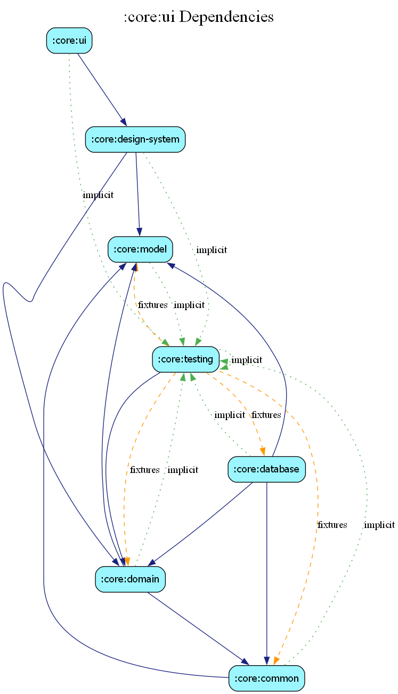

# core:ui

## Overview
The `ui` module contains high-level UI utilities and foundational Compose components that are not specific to the Design System but are shared across multiple features.

## Responsibilities
- **Device Previews**: Centralized annotations for rendering Compose previews on different device configurations (e.g., tablet, foldable, landscape).
- **Performance Monitoring**: Integration with Android Performance Tuner and JankStats to track frame rate and UI stability.
- **Shared Modifiers**: Reusable Compose modifiers for common layout tasks.

## Key Files
- `DevicePreviews.kt`: Multipreview annotations for standardized UI testing in Android Studio.
- `JankStatsExtension.kt`: Utilities for tracking UI performance in real-time.

## Dependency Graph

