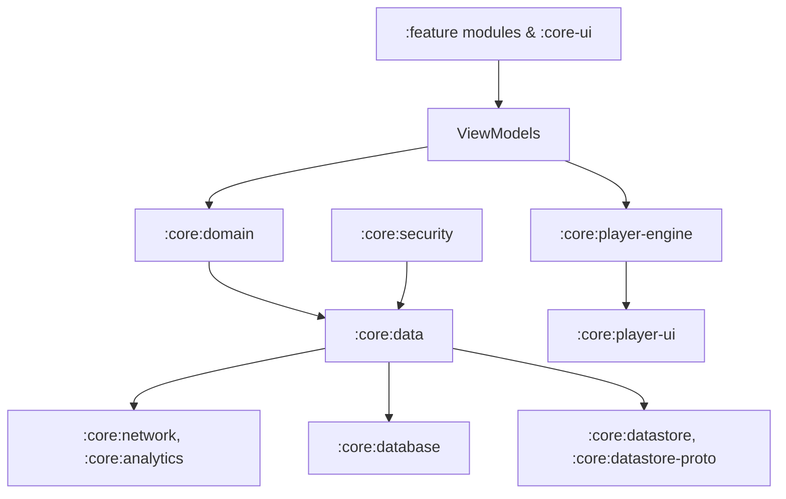
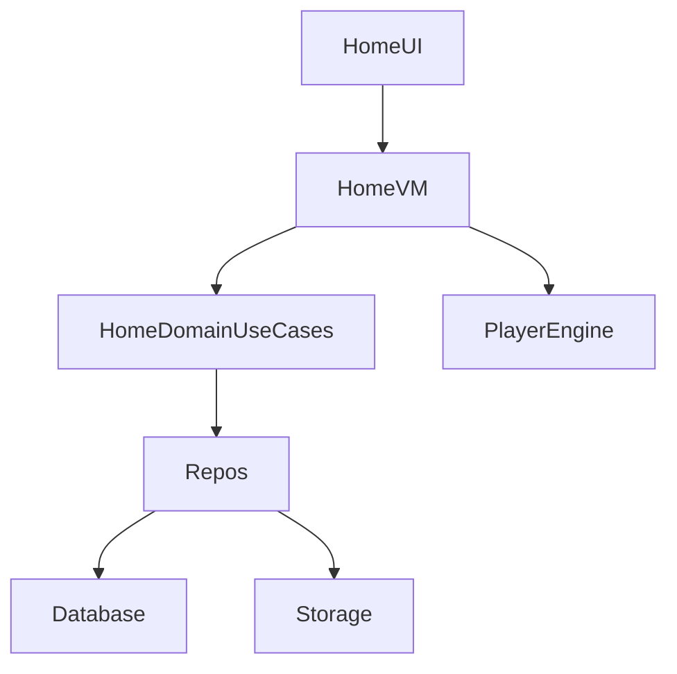
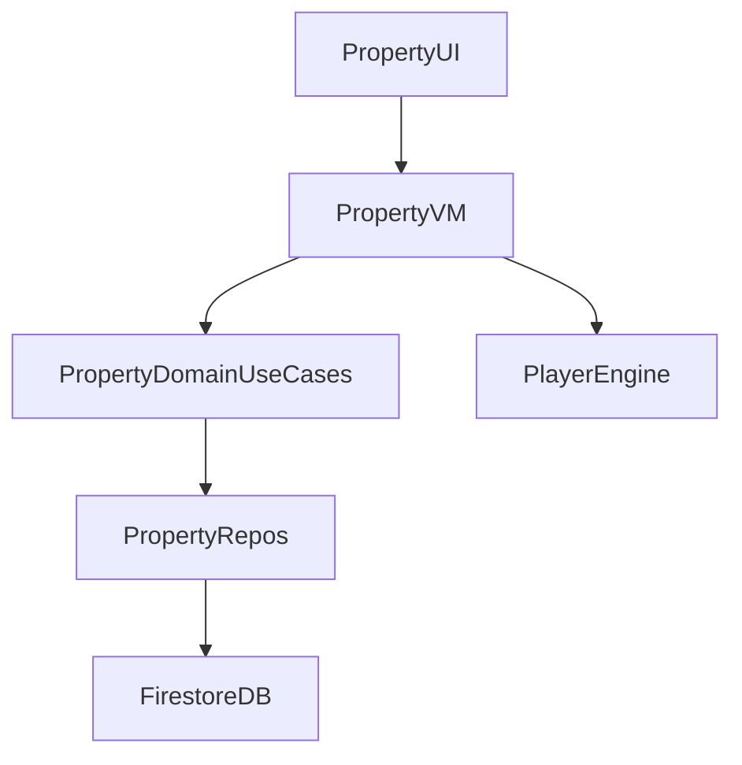
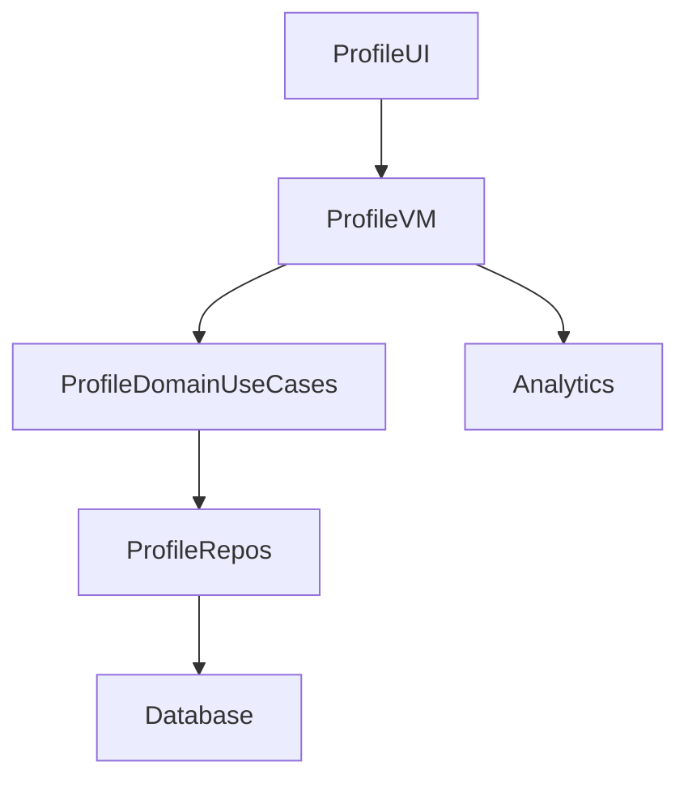
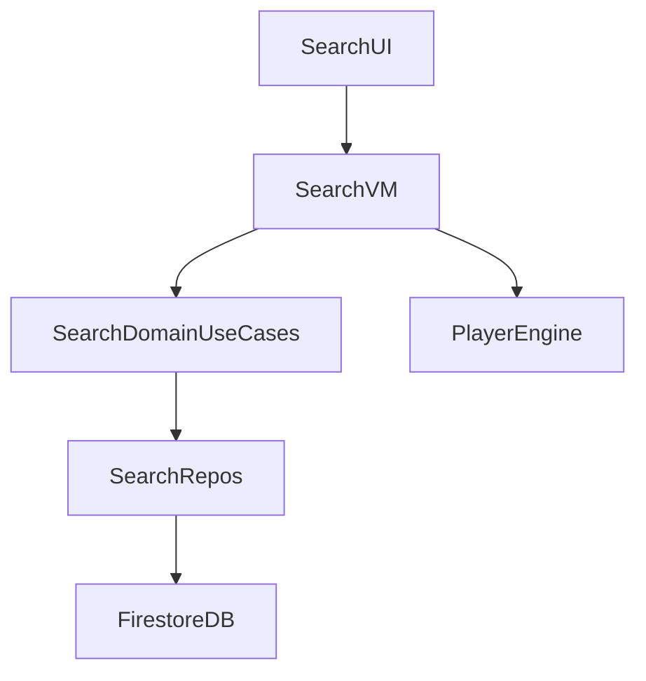

# Estatia_ARCHITECTURE.md

# Estatia — Architecture Deep Dive (Full Module Diagrams)

## Core Principles

* Clean Architecture: separation of UI, domain, and data layers
* Unidirectional Data Flow: deterministic state updates, immutable exposure
* Dependency Inversion: features depend on domain interfaces
* Module Isolation: strict boundaries; no cross-feature direct access
* Lifecycle Safety: state handling across recomposition, process death, concurrency
* Actor-style Concurrency: for media-heavy and async workflows

## Module Responsibilities

| Module              | Responsibility                                                           |
| ------------------- | ------------------------------------------------------------------------ |
| :core:domain        | Use cases, business rules, repository interfaces                         |
| :core:data          | Repository implementations, Firebase/network orchestration               |
| :core:ui            | Shared Compose components, theming, UI primitives                        |
| :core:design-system | Design tokens, typography, colors, component library                     |
| :core:player-engine | ExoPlayer orchestration, prefetch, lifecycle handling, actor-style state |
| :core:player-ui     | Player UI, minimal business logic                                        |
| :core:security      | Role-based access, server-boundary enforcement, verification workflows   |
| Feature modules     | Own ViewModels, navigation, UI logic; depend only on domain interfaces   |

## Feature Module Architecture Examples

### :feature:home

### :feature:property

### :feature:profile

### :feature:search

## Data Flow

1. UI → ViewModel → Domain → Repositories → External Services
2. Immutable state returned to ViewModel → UI

## Concurrency & Lifecycle

* Actor-style state for media
* Thread-safe singletons
* Lifecycle-aware Compose scopes
* Mutable state confined to domain/actor scopes

## Scalability

* Batched Firestore queries, optimized indexes
* Prefetching and caching for media-heavy feeds
* Modular isolation for independent deployment
* Global services thread-safe
