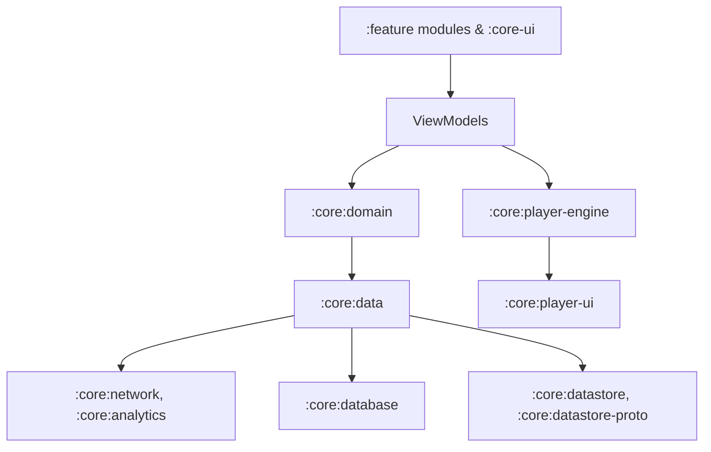

# ARCHITECTURE.md

# Estatia — Architecture Overview



## Core Principles

* Clean Architecture: separation of UI, domain, and data layers
* Unidirectional data flow: deterministic state updates, immutable exposure
* Dependency inversion: features depend on domain interfaces
* Module isolation: strict boundaries, no cross-feature direct access
* Lifecycle-aware design: safe state handling across process death and recomposition

## Module Structure

```
:app
:benchmark
:localization
:lint
:core:analytics
:core:network
:core:ui
:core:common
:core:notifications
:core:data
:core:domain
:core:model
:core:database
:core:security
:core:datastore
:core:player-engine
:core:player-ui
:core:design-system
:core:testing
:core:datastore-proto
:feature:home
:feature:auth
:feature:profile
:feature:search
:feature:property
:feature:intelligence
:feature:payments
:feature:market
:feature:chats
:feature:favorites
:feature:comments
:feature:settings
:feature:service
```

### Responsibilities

* **:core:domain** — Business logic, use cases, repository interfaces, no Android dependencies
* **:core:data** — Repository implementations, Firestore, network orchestration
* **:core:ui & :core:design-system** — Reusable Compose components, themes, UI primitives
* **:core:player-engine & :core:player-ui** — Media playback and UI orchestration, lifecycle-safe, isolated
* **Feature modules** — Own ViewModels, navigation, UI; depend only on domain interfaces

## Data Flow

1. UI → ViewModel (immutable state via StateFlow/LiveData)
2. ViewModel → Domain (use cases)
3. Use cases → Repositories (data layer)
4. Repositories → Services (network, analytics) / Storage / Database
5. Responses → Domain → UI

* Async via Coroutines + Flow
* Errors wrapped in Result/Resource for predictable UI states

## Concurrency & Lifecycle

* Thread-confined state reducers
* Immutable external state exposure
* Actor-style media playback for race-condition safety
* Lifecycle-aware Compose scopes

## Scalability Considerations

* Firestore batch queries and read optimization
* Media-heavy feed prefetching and caching
* Module-level isolation prevents architectural drift
* Thread-safe singletons for global services
