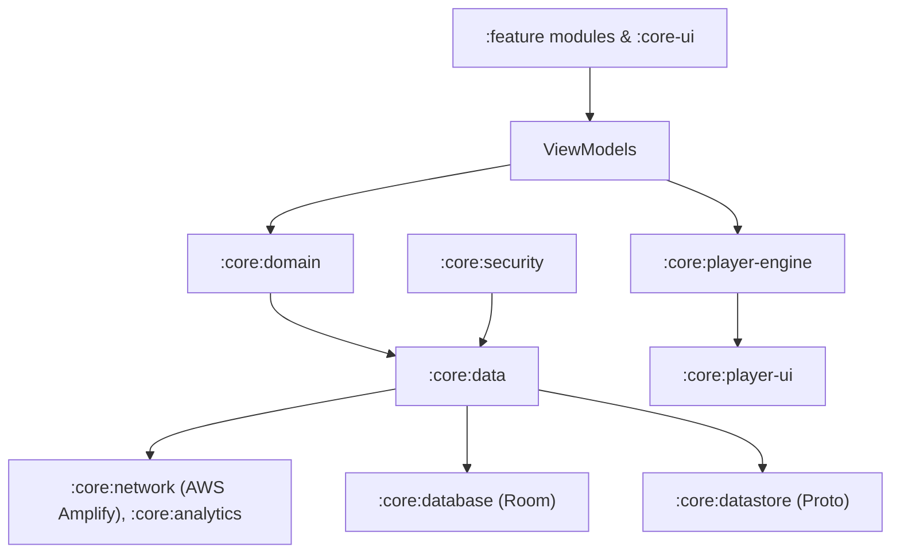
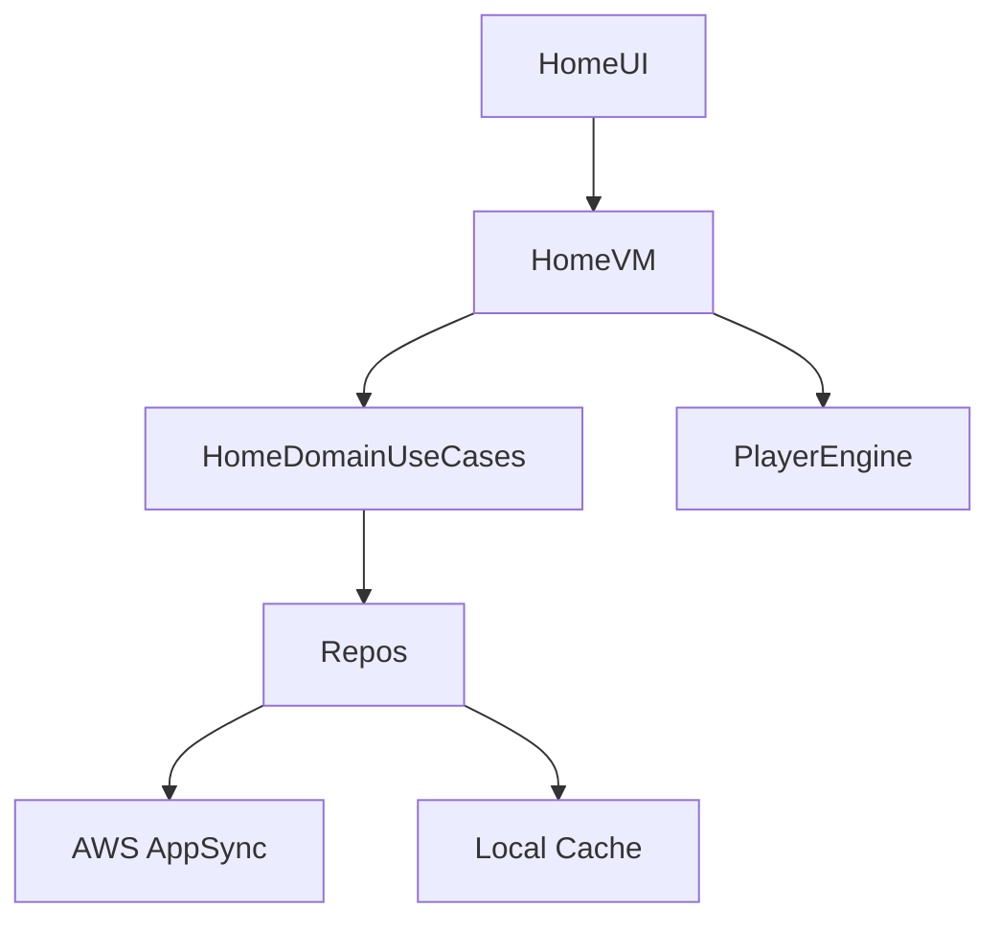
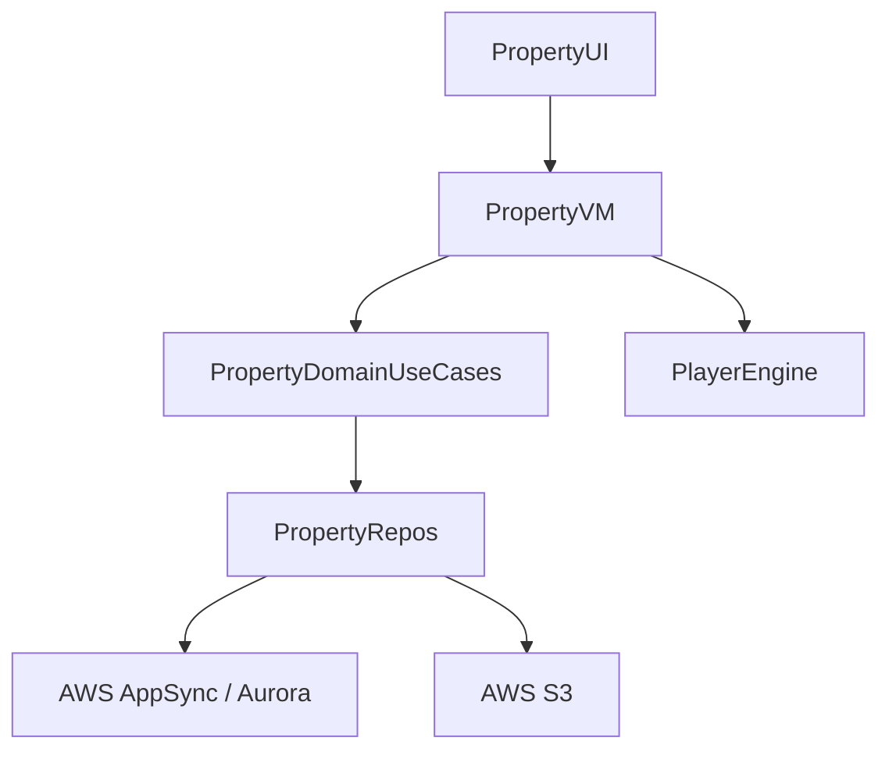
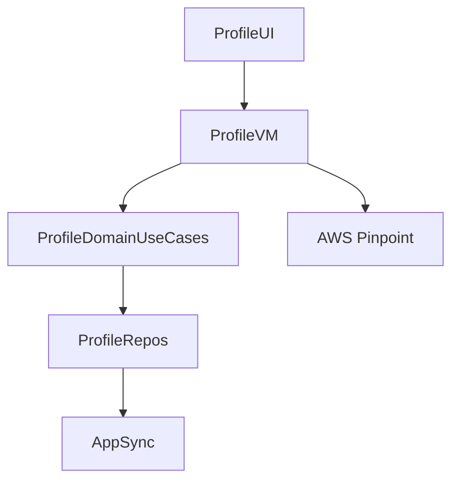
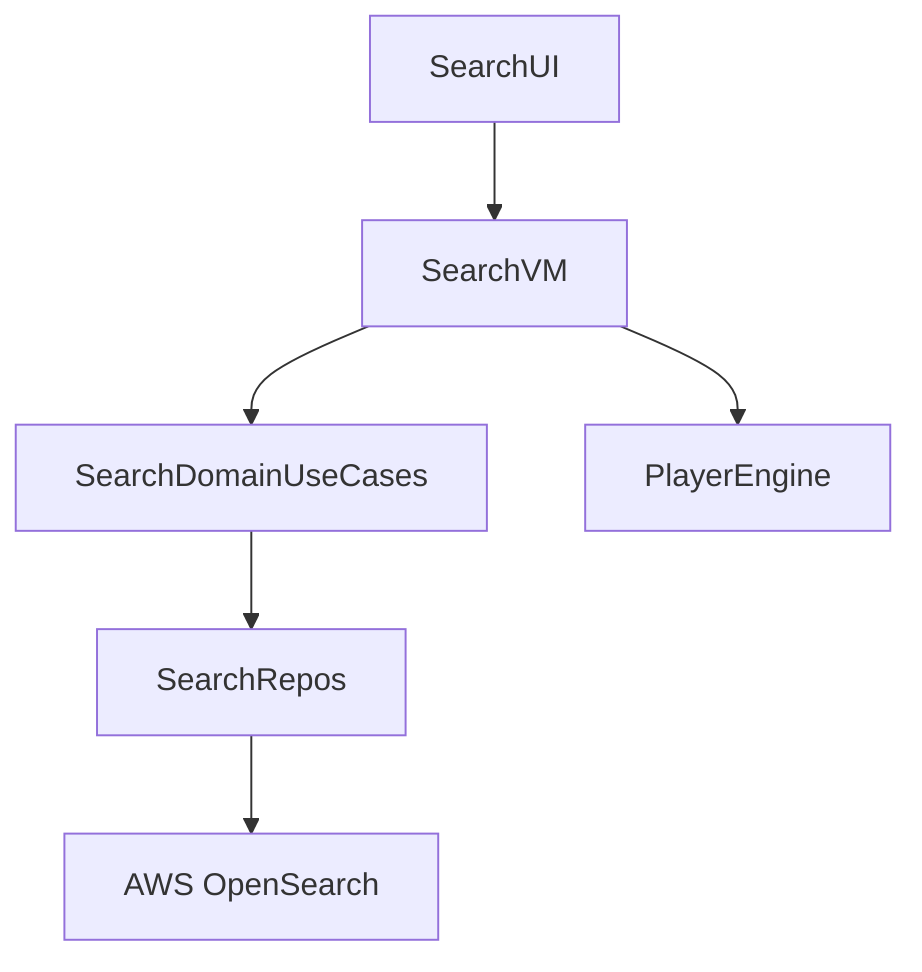

# Estatia — Architecture Deep Dive (Full Module Diagrams)

## Core Principles

* **Clean Architecture**: Separation of UI, domain, and data layers.
* **Unidirectional Data Flow**: Deterministic state updates, immutable exposure.
* **Dependency Inversion**: Features depend on domain interfaces.
* **Interface Segregation**: Clients depend only on the specific configuration or repository roles they require (e.g., `INetworkConfig`, `IPlayerTuningConfig`).
* **Module Isolation**: Strict boundaries; no cross-feature direct access.
* **Lifecycle Safety**: State handling across recomposition, process death, concurrency.
* **Actor-style Concurrency**: For media-heavy and async workflows.

## Module Responsibilities

| Module              | Responsibility                                                           |
| ------------------- | ------------------------------------------------------------------------ |
| :core:domain        | Use cases, business rules, repo/config interfaces (ISP-segregated)        |
| :core:data          | Repository implementations, AWS/network orchestration                    |
| :core:network       | AWS Amplify (Auth, AppSync, S3, Pinpoint, AppConfig) integration         |
| :core:ui            | Shared Compose components, theming, UI primitives                        |
| :core:design-system | Design tokens, typography, colors, component library                     |
| :core:player-engine | Media3 ExoPlayer orchestration, prefetch, adaptive pooling, actor-state |
| :core:player-ui     | Player UI, minimal business logic                                        |
| :core:security      | Key management, encryption, server-boundary enforcement                 |
| Feature modules     | Own ViewModels, navigation, UI logic; depend only on domain interfaces   |

## Feature Module Architecture Examples

### :feature:home

### :feature:property

### :feature:profile

### :feature:search

## Data Flow

1. UI → ViewModel → Domain → Repositories → External Services (AWS Amplify)
2. Immutable state returned to ViewModel → UI

## Concurrency & Lifecycle

* Actor-style state for media
* Thread-safe singletons
* Lifecycle-aware Compose scopes
* Mutable state confined to domain/actor scopes

## Scalability

* GraphQL query optimization with AppSync.
* Personalized feed generation delegated to Lambda Resolvers.
* Prefetching and caching for media-heavy feeds.
* Modular isolation for independent deployment.
* Global services thread-safe.
