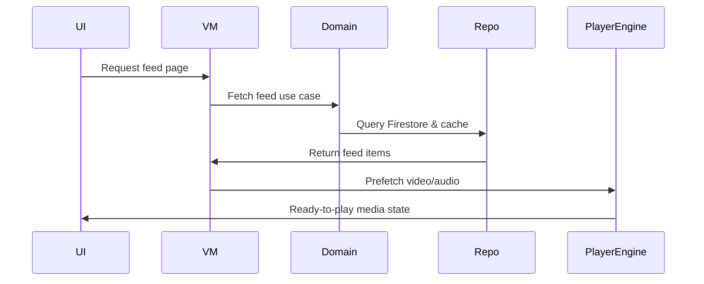
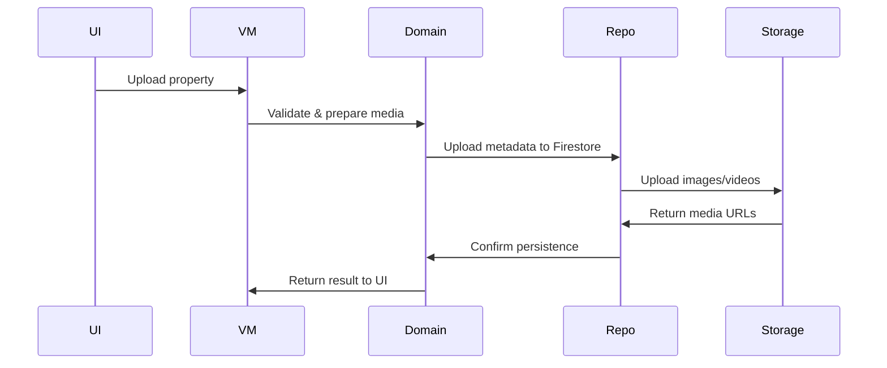
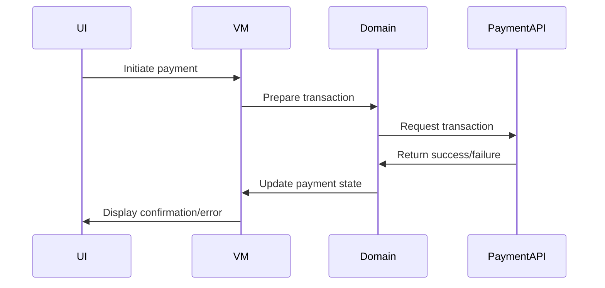
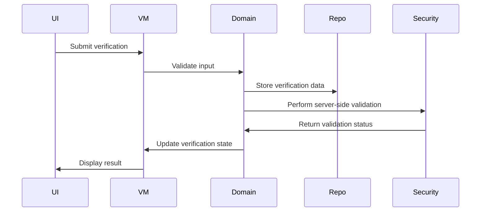
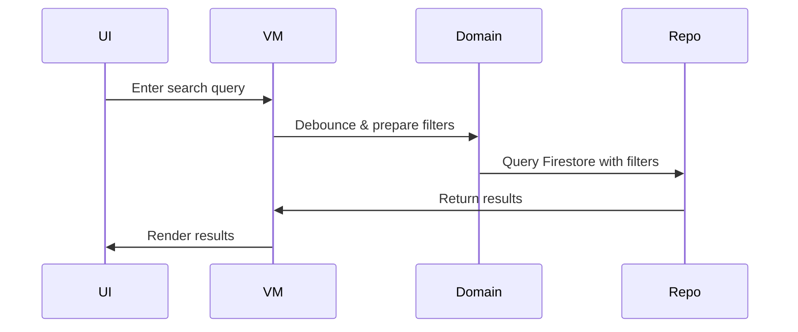

# Estatia_ENGINEERING.md

# Estatia — Engineering Deep Dive (Feature-Specific Patterns + Diagrams)

## Coding Standards

* Kotlin idiomatic practices; immutability preferred
* SOLID principles enforced
* Minimal boilerplate; explicit state and dependencies
* Clear separation between UI, domain, and data logic
* Defensive programming on critical paths

## Testing Strategy

* Domain Layer: Unit tests for all use cases, edge/error scenarios
* Data Layer: Integration tests for repositories, remote/local orchestration
* UI / Feature Layer: Compose UI tests, navigation, interaction tests
* Performance benchmarks for feed scroll, media prefetch, cache handling

## Performance & Profiling

* Baseline Profiles for startup, feed rendering, media playback
* Memory-efficient media caching, ExoPlayer pooling
* Firestore query tuning for large datasets
* Coroutine dispatchers tuned per module for IO vs computation

## Security & Trust

* Role-based access enforced via Firebase custom claims
* Server-side verification for ownership/admin actions
* Input validation on all endpoints
* Clear client/server responsibility boundaries

## CI/CD & Build

* Gradle convention plugins + version catalogs
* Feature module isolation enforced via CI
* Automated linting, static analysis, unit test coverage verification
* Separate build variants: debug, staging, production

## Developer Guidelines

* Feature modules depend only on domain interfaces
* Core-ui and design-system modules for reusable components
* All state exposed immutably; side effects explicit
* PRs require architectural review and test coverage
* Document non-obvious business rules or patterns
* **UI Interaction Blocking**: To prevent gesture conflicts in vertical feeds, any future playback features requiring horizontal or precise gestures (e.g., tap-to-seek or scrub) must explicitly suppress the parent `Pager` scroll recognition (`userScrollEnabled = false`) while the scrub gesture is active.

## Feature-Specific Patterns & Diagrams

### :feature:home — Media Feed Prefetch



### :feature:property — Listing Upload Pipeline



### :feature:payments — Transaction Flow



### :feature:profile — Owner Verification Flow



### :feature:search — Filtered Query Flow



## Example Patterns

### Actor-style Media Playback (Kotlin)

```kotlin
sealed class PlayerCommand {
    data class Play(val mediaId: String) : PlayerCommand()
    object Stop : PlayerCommand()
}

fun CoroutineScope.playerActor() = actor<PlayerCommand> {
    for (cmd in channel) {
        when(cmd) {
            is PlayerCommand.Play -> exoPlayer.prepareAndPlay(cmd.mediaId)
            PlayerCommand.Stop -> exoPlayer.stop()
        }
    }
}
```

### Repository Pattern Example

```kotlin
interface PropertyRepository {
    suspend fun getProperties(): List<PropertyModel>
    suspend fun getPropertyById(id: String): PropertyModel?
}

class PropertyRepositoryImpl(
    private val firestore: FirebaseFirestore
) : PropertyRepository {
    override suspend fun getProperties(): List<PropertyModel> = 
        firestore.collection("properties").get().await().map { it.toObject(PropertyModel::class.java) }
}
```

---

This engineering guide now combines **feature-specific diagrams, patterns, best practices, and flows**, giving developers both visual and code-level references for implementing, testing, and maintaining Estatia modules.
