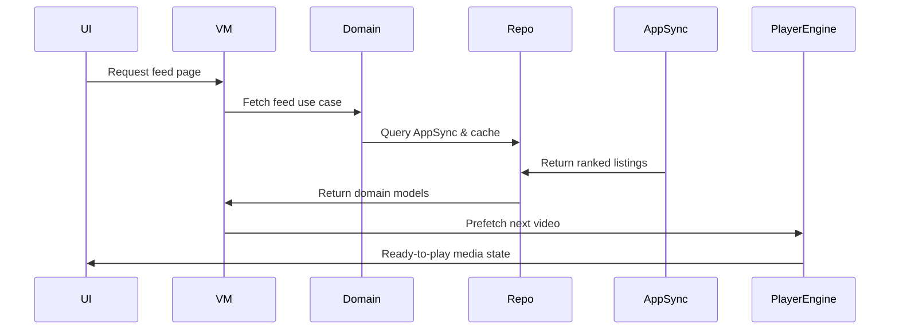
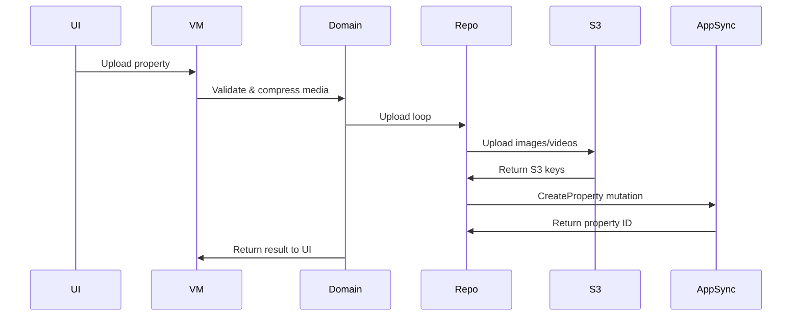
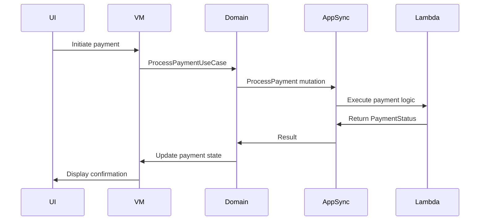

# Estatia — Engineering Deep Dive (Feature-Specific Patterns + Diagrams)

## Coding Standards

* Kotlin idiomatic practices; immutability preferred.
* SOLID principles enforced, with a focus on **Interface Segregation (ISP)** for configuration.
* Minimal boilerplate; explicit state and dependencies via Hilt.
* Clear separation between UI, domain, and data logic.
* Defensive programming on critical paths (e.g., media playback and auth).

## Production-Grade Class Standard

All significant classes must follow the [Production-Grade Class Standard](./PRODUCTION_CLASS_STANDARD.md).

The standard defines requirements for state ownership, concurrency, lifecycle safety, failure handling, resilience, security, observability, performance, deterministic testing, and chaos testing.

## Testing Strategy

* **Domain Layer**: Unit tests for all UseCases using MockK, covering successful data flow and error scenarios (e.g., `AuthException.UserNotAuthenticated`).
* **Data Layer**: Integration tests for repositories and DataSources. Instrumented tests for Room DAOs and Proto DataStore.
* **UI / Feature Layer**: ViewModels are thoroughly tested for state transitions. Compose UI tests and navigation interaction tests.
* **Performance**: Benchmarks for feed scrolling, media prefetch, and cache handling.

## Performance & Profiling

* **Baseline Profiles**: Used for startup, feed rendering, and media playback optimization.
* **Media Orchestration**: Adaptive player pooling and look-ahead prefetching in `core:player-engine`.
* **Adaptive Policies**: Cache sizing and player pool limits scale based on device hardware and thermal status.
* **Observability**: Integrated with Micrometer for real-time telemetry (toggleable via AWS AppConfig).

## Security & Trust

* **Authentication**: Managed via **AWS Cognito** and Amplify Auth.
* **Authorization**: Role-based access control and server-side verification for ownership/admin actions.
* **Data Protection**: AES-GCM and RSA encryption for sensitive local data and payload signing.
* **API Validation**: `ApiKeyValidator` enforces regex patterns for service-specific keys.

## CI/CD & Build

* Gradle convention plugins + version catalogs for centralized build logic.
* Feature module isolation enforced via architecture linting.
* Automated security scanning with Dependabot.
* Build variants: `demo` (mocked data) and `prod` (AWS-connected).

## Developer Guidelines

* **Domain Boundaries**: Feature modules depend only on domain interfaces (segregated by responsibility).
* **State Management**: All state exposed as `StateFlow`; side effects are explicit.
* **Media Gestures**: Any playback features requiring custom gestures must explicitly suppress parent `Pager` scrolling to prevent conflicts.

## Feature-Specific Patterns & Diagrams

### :feature:home — Media Feed Prefetch



### :feature:property — Listing Upload Pipeline



### :feature:payments — Transaction Flow



## Example Patterns

### Interface Segregation for Config

```kotlin
// Clients only see the properties they need
interface IPlayerTuningConfig : IConfigLifecycle {
    val playerTuning: PlayerTuningConfig
}

class PlaybackProvider @Inject constructor(
    private val config: IPlayerTuningConfig
) {
    fun getBuffer() = config.playerTuning.minBufferMs
}
```

### Repository Pattern (GraphQL)

```kotlin
interface IPropertyRepository {
    suspend fun getPropertyById(id: String): AppResult<PropertyDomainModel>
}

class PropertyRepositoryImpl @Inject constructor(
    private val remoteSource: IPropertyRemoteDatasource
) : IPropertyRepository {
    override suspend fun getPropertyById(id: String) = remoteSource.getPropertyById(id)
}
```

---

This guide reflects the **AWS-native, ISP-compliant architecture** of Estatia, providing visual and code-level references for developers.
