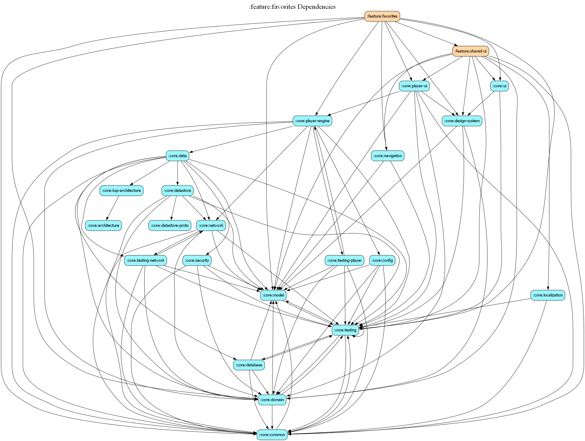

# feature:favorites

## Overview
The `favorites` module provides a dedicated space for users to view and manage their saved property listings. It is a core part of the property discovery journey, allowing users to keep track of interesting apartments.

## Features
- **Saved Listings**: A personalized list of all properties the user has liked.
- **Offline Access**: Leverages the local database to show saved properties even without an active internet connection.
- **Direct Navigation**: Seamless transition from the favorites list to the full property detail view.

## Screen Structure
- `FavoritesScreen`: Displays the collection of saved properties using standard list components.
- `FavoritesViewModel`: Manages the state and loading logic for the user's saved items.

## Dependency Graph

