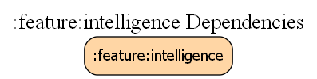

# feature:intelligence — Recommendation & Personalization Engine

The `intelligence` module serves as the primary hub for Estatia's personalized video experience. It orchestrates the high-fidelity feedback loop between client-side engagement signals and server-side ranking models, ensuring every user sees the properties they are most likely to love.

## 🏗️ 1. Recommendation Architecture

Estatia uses a **Hybrid Intelligence** model to achieve TikTok-class feed responsiveness:

### Server-Side Canonical Brain
The "True Source of Truth" for recommendations lives on the server (AWS AppSync + Aurora). It processes global trends and collaborative filtering cohorts to generate a pre-ranked list of properties for each user.
- **Personalized Ranking**: When `fetchPropertiesPaginated(userId)` is called, the server sorts listings specifically for that user's taste profile.
- **Match Scores**: The server injects a transient `matchScore` (0.0 to 1.0) for every item in the API response. This score represents the model's confidence that the user will engage with that specific property.

### Client-Side Execution (Player Engine Awareness)
The `player-engine` remains algorithm-blind but is **Match-Aware**. It consumes the `matchScore` to intelligently allocate hardware and network resources:
- **High Match (>0.9)**: "Deep Warming" — Prefetches 3+ segments and prepares a hardware decoder immediately to ensure a zero-latency start.
- **Low Match (<0.4)**: "Speculative Only" — Fetches only the manifest to save user data in case the item is skipped.

## 🔄 2. The Feedback Loop (Telemetry)

The loop is closed by shipping high-fidelity engagement signals from the client back to the server:

### Signal Generation
The `PlaybackAnalyticsListener` captures granular interaction data:
- **Watch Percentage**: (Time Watched / Video Duration).
- **Loop Counts**: Number of times a video was automatically replayed.
- **Interaction Signals**: Likes, shares, and comment expands.

### Signal Shipping
Engagement data is batched and shipped to a durable telemetry sink (e.g., AWS Kinesis Firehose). This data is then used to refine the user's preference profile and train the ranking models for the next session.

## 📱 3. User Experience Impact

- **Instant Gratification**: By pre-warming high-match content deeper than standard content, the app achieves the "instant-play" feel during scrolls.
- **Data Discipline**: Proactively reduces data waste by not pre-loading large chunks of low-probability content.
- **Continuous Improvement**: Every scroll and loop helps the engine learn the user's preferred property types (e.g., modern apartments vs. rustic cottages).

---

## 🛠️ Implementation Details

### Key Classes
- **`EngagementSignalProcessor`**: Manages the local aggregation and shipping of engagement events.
- **`VideoPlaybackCoordinator`**: Interprets match scores to drive prefetch depth.
- **`PlaybackAnalyticsListener`**: The primary sensor for capturing real-time engagement metrics.

### Technical Glossary
| Term | Definition |
|---|---|
| **Match Score** | A 0-1 confidence value injected by the server for a specific User-Listing pair. |
| **Deep Warming** | Concurrent prefetch of segments + hardware player allocation. |
| **Engagement Signal** | A telemetry event containing normalized interaction metrics (e.g., watch %). |

## Dependency Graph

