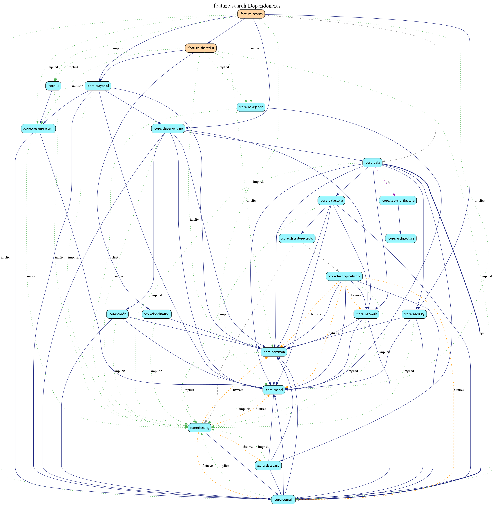

# feature:search

## Overview
The `search` module provides the discovery interface for the Estatia property catalog. It combines traditional text-based search with real-time feedback and search history management.

## Features
- **Dynamic Search**: Interactive search field with instant results.
- **Search History**: Quick access to recent searches via suggestion chips.
- **Visual Results**: Displays search matches using the high-performance vertical video feed component.

## Key Components
- `SearchScreen`: Manages transitions between initial, history, loading, and success states.
- `SearchViewModel`: Handles search logic and persistence of user search history.

## Dependency Graph

