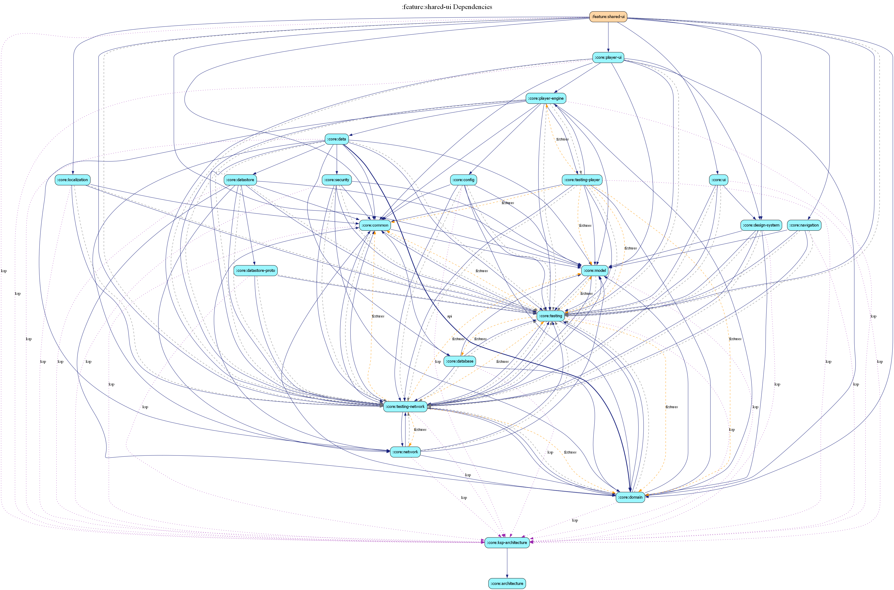

# feature:shared-ui

This module provides high-level, domain-aware UI components and screens that are shared across multiple feature modules (e.g., Home, Search, Favorites).

## Architectural Rationale

In a strict Clean Architecture or "Feature-Modular" structure, feature modules should be vertically isolated and never depend on one another. However, the Estatia project encountered a common dilemma: **Vertical isolation vs. High-level code duplication.**

### The Problem
We have several features (Home, Search, Favorites) that all require a complex, vertical video feed for properties.
- **Option A (Strict Isolation)**: Duplicate the `PropertyFeedScreen` and `PropertyFeedItem` logic in every feature. This leads to a maintenance nightmare where design or logic changes must be synchronized across 3+ places.
- **Option B (Move to `:core:ui`)**: Place these components in a core module. This violates core principles because core modules should be business-logic-agnostic. It would force `:core:ui` to depend on `:core:model` and `:core:player-engine`, bloating the core layer with feature-specific knowledge.

### Our Solution: The "Shared Feature" Pattern
We decided to create `:feature:shared-ui` as a **horizontal shared layer**. 

While this technically "breaks" the rule of total feature isolation, it is a pragmatic decision based on the following benefits:
1. **DRY (Don't Repeat Yourself)**: Complex coordination between the Property model, Media3 Player Engine, and high-level Compose Pagers is defined exactly once.
2. **Core Purity**: `:core:ui` remains a library of true primitives (stateless buttons, layout grids, jank-tracking utilities) that could theoretically be used in a completely different app.
3. **Controlled Coupling**: Feature modules (Home, Search, etc.) still do not depend on *each other*. They depend on a common capability module. This is significantly safer than making `:feature:home` depend on `:feature:search`.

## When to use this module
- Use `:core:ui` for low-level components that don't know what a "Property" or a "User" is.
- Use `:feature:shared-ui` for high-level patterns (Feeds, Detail overlays, specialized Gallery views) that need to understand Estatia's domain models to remain expressive.

> [!IMPORTANT]
> If a component in this module becomes too specific to a single feature, it should be moved back into that feature's specific module. This module is reserved for **cross-cutting UI patterns** only.

## Dependency Graph

